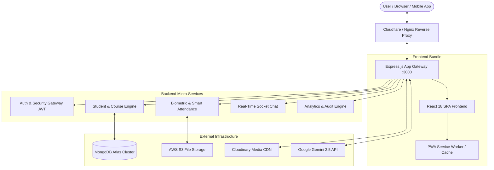
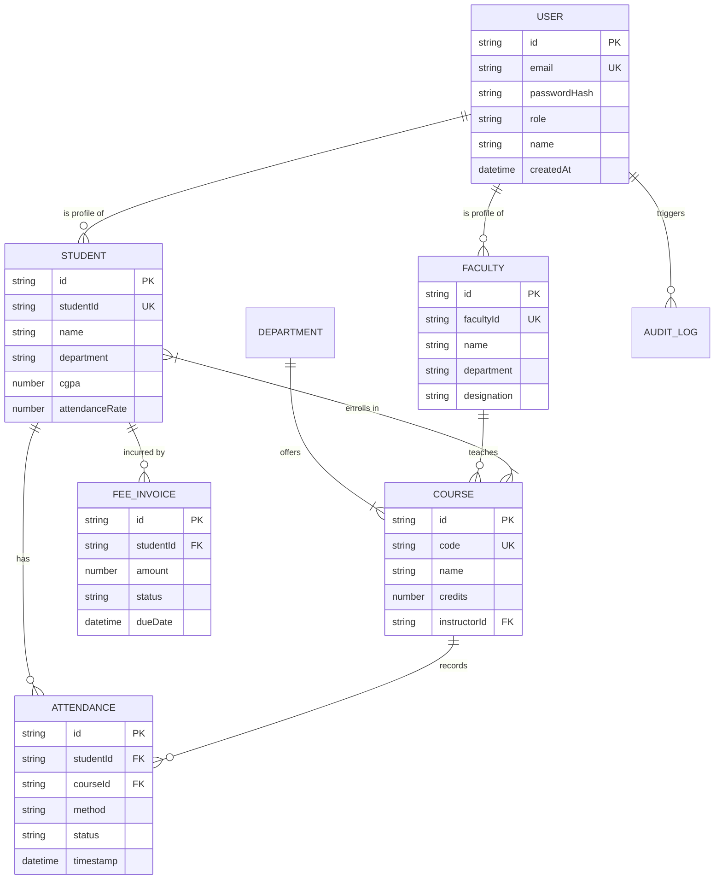
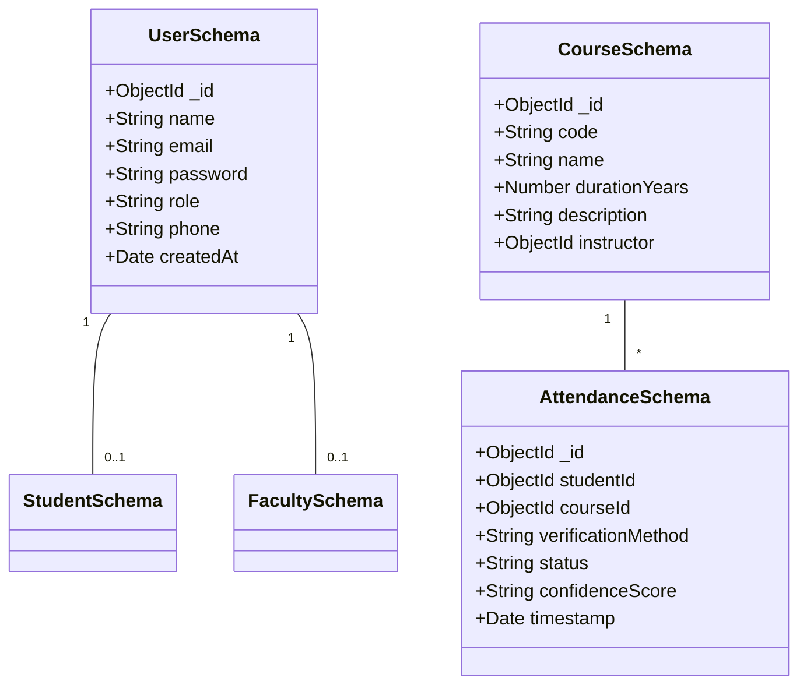
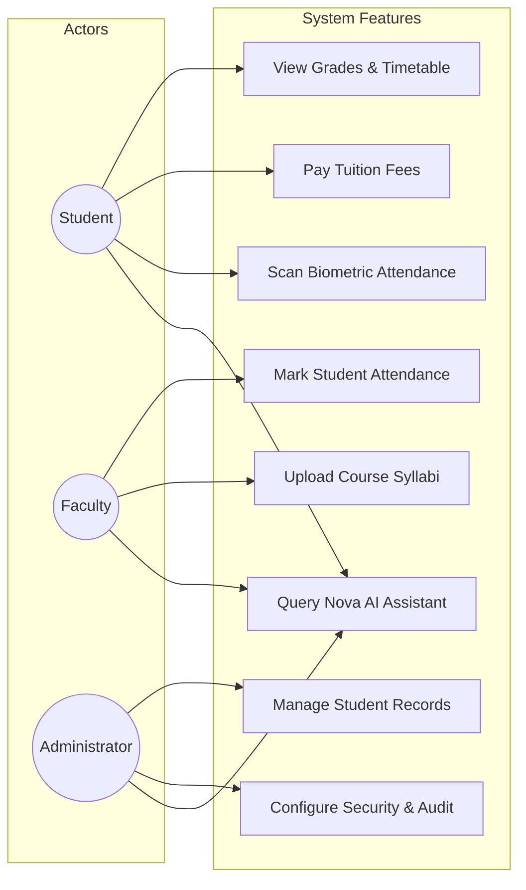
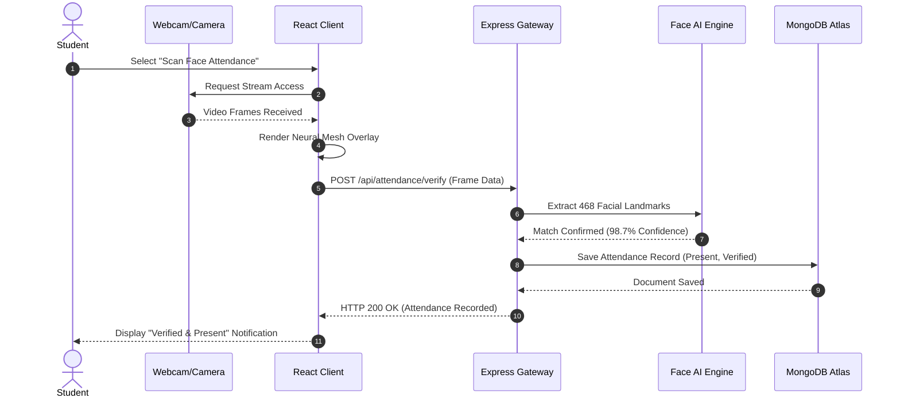

# Smart Campus ERP - Enterprise Architecture & Data Models

This file contains Mermaid diagrams illustrating system architecture, database schema, entity relationships, use cases, and request sequence flows.

---

## 1. System Architecture Diagram



---

## 2. Entity-Relationship (ER) Diagram



---

## 3. Database Schema Diagram



---

## 4. Use Case Diagram

```mermaid
usecaseDiagram
```



---

## 5. Sequence Diagram: Biometric Attendance Flow


